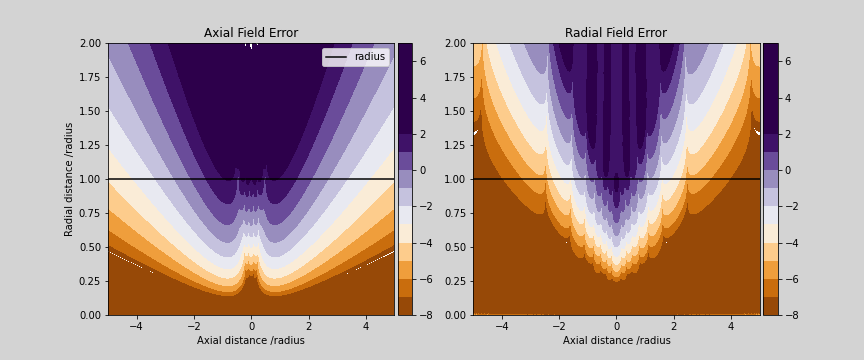

# rustpycoils

Python wrapper around [rustycoils](https://www.github.com/jdrtommey/rustycoils).

This module provides an implementation of an algorithm for finding the off-axis magnetic field of solenoidal systems of current loops.

An analytic solution to the ideal wire loop is readily available and can be computed using elliptical integrals which are also readily available in libraries such as scipy. To approximate other solenoidal magnetic field systems, such as solenoids and Helmholtz coils, this basic primitive can be duplicated however this will start to slow down as more primitives are added. Additionally provided the magnetic field is only required to be accuratly known close to the central axis of symmetry a faster power series method can be employed to determine the field for any system for which the magnetic field on the axis is known. 

This module impliments the primitive objects discussed in [Off-axis expansion solution of Laplace's equation: Application to accurate and rapid calculation of coil magnetic fields](https://ieeexplore.ieee.org/document/760416) which crucially have analytic derivatives to arbitrary powers allowing for fast and accurate higher order derivatives of the total magnetic field to be computed. Using these primitives to build up the total system allows for magnetic systems of coils to be accuratly and rapidly be computed close to the axis. 

This is not a general alternative for modules such as [magpylib](https://magpylib.readthedocs.io/en/latest/) which offer analytic expressions for magnetic fields based on primitives, and provided there is no material response, give exact solutions. It is instead useful when a magnetic field with cylindrical symmetry is being calculated for use in an atomic beam simulation (my use case). In particular when only the region close to the center of the coil is needed. This can be highlighted by comparing the speed of the algorithm against the analytical provided in [magpylib](https://magpylib.readthedocs.io/en/latest/) for the ideal wire loop. The test uses a wire loop with a radius of 1m and a current of 1A. 

###### Speed comparision

As can be seen inset in the left-hand figure this library can compute the magnetic field of a single position around 200 times faster. As the number of positions which need to be computed concurrently increases this increases particulary after around 4000 positions. The speed increase is more dramatic when a number of wire loops are included in the calculation, such as to model a solenoid or a pair of helmholtz coils. This is shown on the right where the magnetic field is computed at a single location at the center of the coils as the number of coils increases. 

###### Accuracy Comparison

Caution needs to be taken to ensure this algorithm is used correctly however. Unlike the solution provided by elliptical integrals, the range of applicitability of this algorthim is not accurate everywhere. The paper from which this library is derived claims accuracies of around 0.1% can be achieved at radial positions 70% of the radius. To get a picture of the level of accuracy to expect, the results of rustycoils are compared to [magpylib](https://magpylib.readthedocs.io/en/latest/). 

The agreement between the two libraries for both the axial (left) and radial (right) magnetic fields for positions which are located 70cm away from the middle of the wire loop. The agreement between the two codes saturates at around 1e-8% due to the discreprency in the definition of the vacuum permeability, where magpylib uses to be using 4π e-7 H/m. 

The agreement for a wide range of axial and radial positions is shown below:

Up to around 25% of the radius of the coil the agreement is at the level of agreement in the vacuum permiability for all possible axial positions. For radial positions approaching and larger than the radius the algorithm performs very poorly unless located very far away along the axial direction. These comparisons only show the accuracies for the given input parameters however they give a good idea of the range of applicability of this library. 

